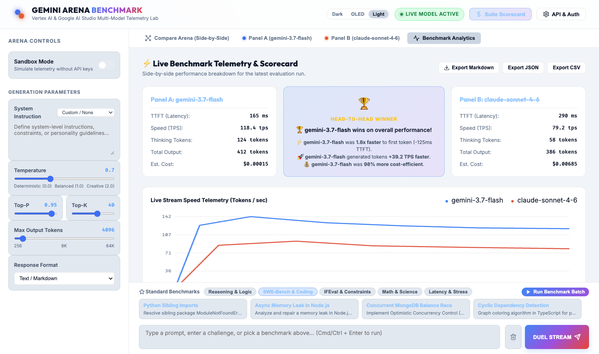

# Gemini Arena & Benchmarking Suite — Vertex AI & Google AI Studio

A sleek, premium, and zero-dependency local web arena designed to benchmark, interact with, and perform side-by-side stream duels between **Google Gemini (3.7 / 3.6 / 3.5 / 3.0 / 2.5 / 2.0 / 1.5 Series)** and **Anthropic Claude** models across **Google AI Studio** and **Google Cloud Vertex AI**.

Runs on a lightweight vanilla Node server with zero `node_modules` required.



---

## 🎨 Key Features & Innovations

- **Comprehensive Gemini 3.x & 2.5 Support**:
  - `gemini-3.7-flash` (State-of-the-Art Hybrid Reasoning Default)
  - `gemini-3.6-flash` & `gemini-3.5-flash`
  - `gemini-3.0-flash` & `gemini-3.0-pro`
  - `gemini-2.5-pro` (SOTA Reasoning & Coding)
  - `gemini-2.5-flash` & `gemini-2.5-flash-lite` (High Speed & Throughput)
  - `gemini-2.0-flash`, `gemini-2.0-flash-lite`, `gemini-2.0-pro-exp-02-05`
  - `gemini-1.5-pro` & `gemini-1.5-flash`
  - **Custom Model ID Entry**: Benchmark any fine-tuned or custom endpoint.
- **Dual Authentication Modes**:
  - **Google AI Studio API Key (`AIzaSy...`)**: Instant live access with zero GCP configuration required.
  - **Google Cloud Vertex AI**: Native OAuth Access Token (`gcloud`) or Service Account JSON key (with native RSA-SHA256 JWT signing and auto-refresh).
- **Automated Benchmarking Suites**:
  - **Reasoning & Logic**: Logic grids, counterfactual physics, causality, ARC-AGI pattern shifts.
  - **SWE-Bench & Coding**: Package imports, async memory leaks, MongoDB race conditions, cyclic graph coloring.
  - **IFEval & Constraints**: Negative constraints, character prohibitions, exact word counts, strict JSON schema output.
  - **Math & Science**: Bayes theorem, combinatorics proofs, dynamical stability.
  - **Latency & Stress**: High-throughput bursts, sorted dictionary synthesis, code golf.
  - **Batch Runner**: One-click execution of entire benchmark categories.
- **Real-Time Telemetry & Head-to-Head Scorecard**:
  - ⚡ **TTFT (Time To First Token)** with latency delta.
  - 🚀 **Tokens/sec (TPS)** streaming speed meter & live Canvas chart.
  - 🧠 **Reasoning Tokens**: Dedicated tracking and segmented breakdown bar.
  - 💰 **Dynamic Est. Cost**: Live rate calculation per 1M tokens.
  - 🏆 **Winner Verdict**: Automatically scores speed, latency, and cost efficiency.
  - 📥 **Export Reports**: Download benchmark results in Markdown, JSON, or CSV.
- **Modern Web Dev UX**:
  - Themes: **Cyber Dark**, **Deep OLED Black**, and **Studio Light**.
  - Rich Markdown renderer with syntax-highlighted code blocks and 1-click copy buttons.
  - Collapsible reasoning trace drawer with trace token counts and copy button.
  - Keyboard shortcuts (`Cmd/Ctrl+Enter` to duel, `Cmd/Ctrl+K` to clear, `Esc` to close modal).

---

## 🚀 Quick Start (Running Locally)

1. Open your terminal in this directory:
   ```bash
   cd vertex-ai-playground
   ```

2. Run the server using native Node:
   ```bash
   node server.js
   ```

3. Open your browser and navigate to:
   ```
   http://localhost:4000
   ```

4. **Sandbox Mode** is active immediately out-of-the-box. Pick any benchmark prompt or type a custom message and hit **DUEL STREAM**!

---

## 🔑 Authentication Options

To run live models against Google endpoints:

### Option 1: Google AI Studio API Key (Fastest Setup)
1. Get a free API key at [aistudio.google.com/apikey](https://aistudio.google.com/apikey).
2. Click **API & Auth** in the top right of the playground.
3. Select **Google AI Studio API Key**, paste your `AIzaSy...` key, and click **Save Settings**.
4. (Optional) Alternatively, export `GEMINI_API_KEY="your_api_key"` in a `.env` file.

### Option 2: Google Cloud Vertex AI (OAuth Access Token)
1. Generate a token via Google Cloud SDK:
   ```bash
   gcloud auth print-access-token
   ```
2. In the **API & Auth** modal, select **GCP OAuth Access Token**, provide your **Project ID**, **Region**, and token.

### Option 3: Google Cloud Vertex AI (Service Account JSON)
1. In the **API & Auth** modal, select **GCP Service Account JSON**.
2. Paste the contents of your Service Account JSON key. The server automatically signs assertions via native RSA crypto.

---

## 📊 Supported Models & Pricing Reference

| Provider | Model ID | Input (per 1M) | Output (per 1M) | Primary Capability |
| :--- | :--- | :--- | :--- | :--- |
| **Google** | `gemini-3.7-flash` | $0.075 | $0.30 | SOTA Hybrid Reasoning & Thinking Budget |
| **Google** | `gemini-3.6-flash` | $0.075 | $0.30 | Gemini 3.x Series |
| **Google** | `gemini-3.5-flash` | $0.075 | $0.30 | Gemini 3.5 Series |
| **Google** | `gemini-3.0-flash` | $0.075 | $0.30 | Gemini 3.0 Flash Preview |
| **Google** | `gemini-3.0-pro` | $1.25 | $5.00 | Gemini 3.0 Pro Reasoning |
| **Google** | `gemini-2.5-pro` | $1.25 | $5.00 | Heavyweight Coding & Deep Logic |
| **Google** | `gemini-2.5-flash` | $0.075 | $0.30 | Versatile Multimodal Workhorse |
| **Google** | `gemini-2.5-flash-lite` | $0.0375 | $0.15 | Ultra Low Latency & High Throughput |
| **Google** | `gemini-2.0-flash` | $0.075 | $0.30 | Rapid Response Speed |
| **Google** | `gemini-1.5-pro` | $1.25 | $5.00 | 2M Context Window |
| **Anthropic** | `claude-sonnet-4-6` | $3.00 | $15.00 | High-Effort Reasoning |
| **Anthropic** | `claude-opus-4-7` | $5.00 | $25.00 | Deep Analysis |
| **Anthropic** | `claude-haiku-4-5` | $1.00 | $5.00 | Cost / Latency Optimized |
